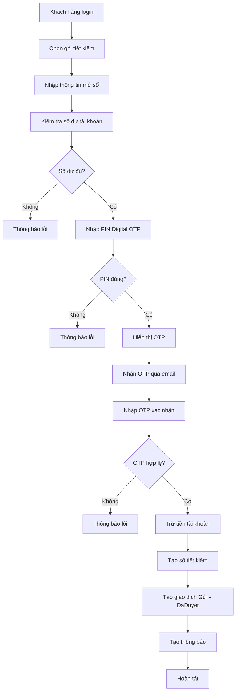
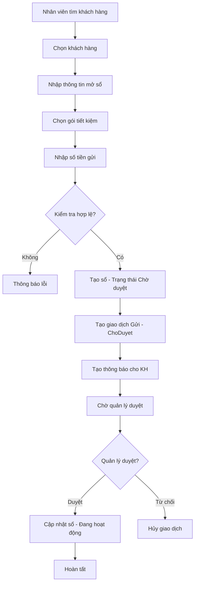
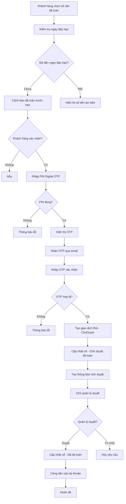
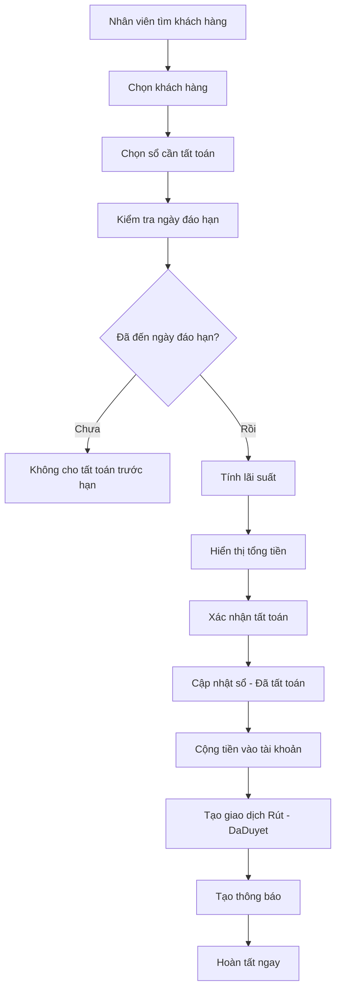
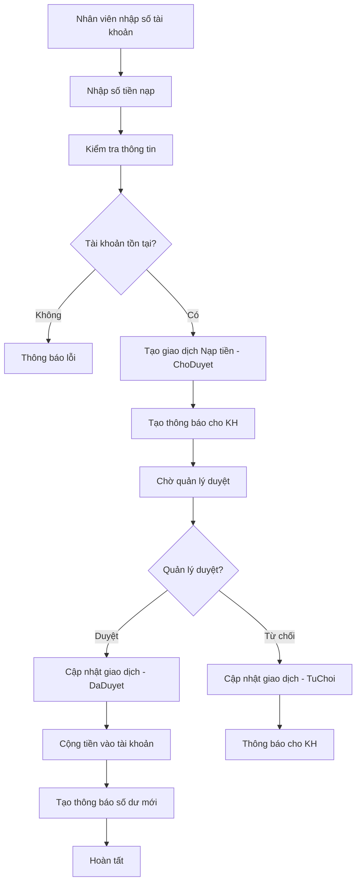
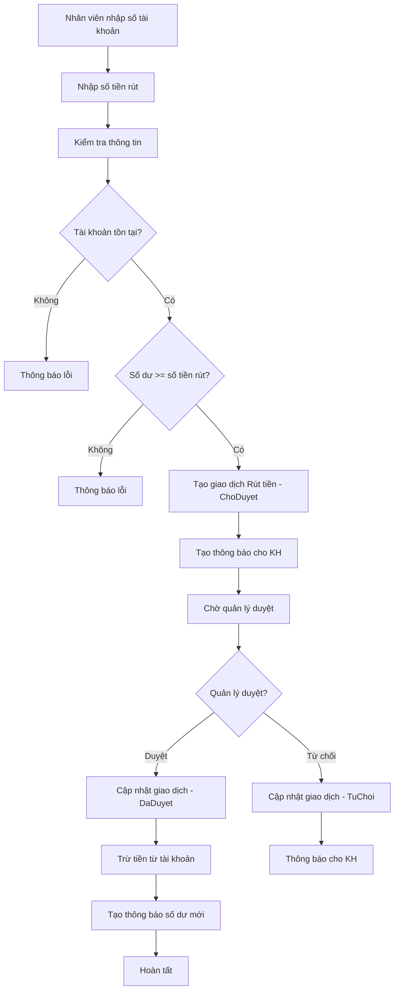
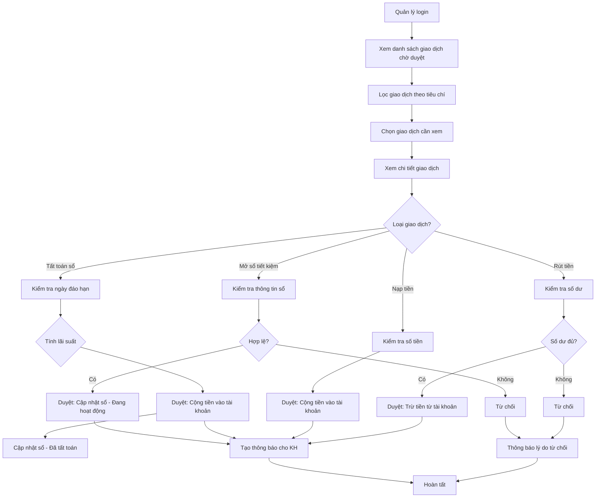
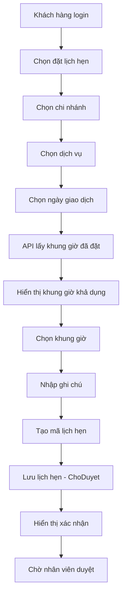
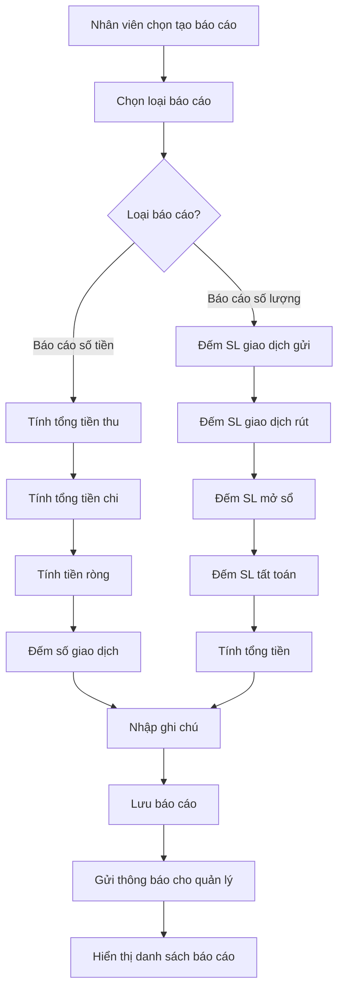

# Hệ Thống Gửi Rút Tiền Tiết Kiệm Theo Nghiệp Vụ Ngân Hàng

## Mục Lục

1. [Tổng Quan Dự Án](#tổng-quan-dự-án)
2. [Kiến Trúc Hệ Thống](#kiến-trúc-hệ-thống)
3. [Phân Quyền Người Dùng](#phân-quyền-người-dùng)
4. [Các Phân Hệ Chính](#các-phân-hệ-chính)
   - 4.1 [Phân Hệ Khách Hàng](#phân-hệ-khách-hàng)
   - 4.2 [Phân Hệ Nhân Viên Giao Dịch](#phân-hệ-nhân-viên-giao-dịch)
   - 4.3 [Phân Hệ Quản Lý](#phân-hệ-quản-lý)
   - 4.4 [Phân Hệ Admin](#phân-hệ-admin)
5. [Chi Tiết Các Luồng Nghiệp Vụ](#chi-tiết-các-luồng-nghiệp-vụ)
   - 5.1 [Luồng Đăng Ký & Đăng Nhập](#luồng-đăng-ký--đăng-nhập)
   - 5.2 [Luồng Mở Sổ Tiết Kiệm](#luồng-mở-sổ-tiết-kiệm)
   - 5.3 [Luồng Tất Toán Sổ Tiết Kiệm](#luồng-tất-toán-sổ-tiết-kiệm)
   - 5.4 [Luồng Giao Dịch Tại Quầy](#luồng-giao-dịch-tại-quầy)
   - 5.5 [Luồng Duyệt Giao Dịch](#luồng-duyệt-giao-dịch)
   - 5.6 [Luồng Đặt Lịch Hẹn](#luồng-đặt-lịch-hẹn)
   - 5.7 [Luồng Báo Cáo Ngày](#luồng-báo-cáo-ngày)
6. [Cơ Sở Dữ Liệu](#cơ-sở-dữ-liệu)
7. [Bảo Mật & Xác Thực](#bảo-mật--xác-thực)
8. [Thông Báo Hệ Thống](#thông-báo-hệ-thống)

---

## Tổng Quan Dự Án

**Tên dự án**: Hệ Thống Gửi Rút Tiền Tiết Kiệm Theo Nghiệp Vụ Ngân Hàng

**Mục đích**: Xây dựng hệ thống quản lý nghiệp vụ gửi tiết kiệm ngân hàng với các chức năng:
- Quản lý tài khoản khách hàng và sổ tiết kiệm
- Thực hiện giao dịch gửi/rút tiền tiết kiệm
- Quản lý duyệt giao dịch theo quy trình 2 bước
- Báo cáo giao dịch hàng ngày
- Đặt lịch hẹn giao dịch tại chi nhánh
- Chatbot hỗ trợ khách hàng

**Công nghệ sử dụng**:
- Backend: ASP.NET Core MVC (.NET 8.0)
- Database: SQL Server
- ORM: Entity Framework Core
- Authentication: ASP.NET Core Identity
- Email Service: MailKit (SMTP Port 465)
- Frontend: Razor Views, jQuery, Bootstrap

---

## Kiến Trúc Hệ Thống

### Mô hình MVC (Model-View-Controller)

```
┌─────────────────────────────────────────┐
│          Presentation Layer             │
│    (Views - Razor Pages/Controllers)    │
└─────────────────────────────────────────┘
                   ↕
┌─────────────────────────────────────────┐
│         Business Logic Layer            │
│        (Controllers/Services)           │
└─────────────────────────────────────────┘
                   ↕
┌─────────────────────────────────────────┐
│          Data Access Layer              │
│    (Entity Framework + Models)          │
└─────────────────────────────────────────┘
                   ↕
┌─────────────────────────────────────────┐
│          Database (SQL Server)          │
└─────────────────────────────────────────┘
```

### Cấu trúc thư mục

```
HeThongGuiRutTienTietKiemTheoNghiepVuNganHang/
├── Controllers/
│   ├── AdminController.cs
│   ├── CustomerController.cs
│   ├── TransactionController.cs
│   ├── ManagementController.cs
│   ├── BankingTransactionController.cs
│   ├── DailyReportController.cs
│   └── ...
├── Models/
│   ├── User.cs
│   ├── SoTietKiem.cs
│   ├── GiaoDichTietKiem.cs
│   ├── TaiKhoanNganHang.cs
│   └── ...
├── Views/
│   ├── Admin/
│   ├── Customer/
│   ├── Transaction/
│   ├── Management/
│   └── ...
├── Services/
│   ├── ChatbotService.cs
│   └── LoginTrackingService.cs
├── Areas/Identity/Pages/Account/
└── Program.cs
```

---

## Phân Quyền Người Dùng

Hệ thống có 4 vai trò chính:

### 1. **Admin** (Quản trị viên cao cấp)
- Quản lý người dùng (khóa/mở khóa, reset password, gán role)
- Quản lý vai trò hệ thống
- Quản lý chi nhánh ngân hàng
- Quản lý loại dịch vụ
- Quản lý khung giờ giao dịch
- Xem lịch sử đăng nhập
- Gửi thông báo hệ thống
- Giám sát session người dùng

### 2. **NhanVienQuanLy** (Quản lý chi nhánh)
- Duyệt giao dịch do nhân viên tạo
- Xem báo cáo tổng quan
- Theo dõi hoạt động của nhân viên
- Nhận thông báo từ hệ thống
- Giám sát giao dịch chờ duyệt

### 3. **NhanVienGiaoDich** (Nhân viên quầy)
- Tạo mới giao dịch cho khách hàng
- Nạp/rút tiền tài khoản thanh toán
- Mở sổ tiết kiệm tại quầy
- Tất toán sổ tiết kiệm
- Tìm kiếm và xem thông tin khách hàng
- Gửi thông báo cho khách hàng
- Lập báo cáo giao dịch ngày

### 4. **KhachHang** (Khách hàng cá nhân)
- Xem thông tin tài khoản và sổ tiết kiệm
- Tự mở sổ tiết kiệm online
- Yêu cầu tất toán sổ tiết kiệm
- Xem lịch sử giao dịch
- Đặt lịch hẹn tại chi nhánh
- Thiết lập và đổi mã PIN Digital OTP
- Nhận thông báo từ ngân hàng

---

## Các Phân Hệ Chính

### 4.1 Phân Hệ Khách Hàng

#### Controller: `CustomerController.cs`

**Chức năng chính:**

##### a. Dashboard (`/Customer/Dashboard`)
- Hiển thị tổng quan tài khoản
- Số dư tài khoản thanh toán
- Tổng tiền tiết kiệm
- Danh sách sổ tiết kiệm đang hoạt động
- Giao dịch gần đây
- Thông báo mới nhất

##### b. Hồ sơ cá nhân (`/Customer/Profile`)
- Xem thông tin cá nhân (CCCD, SĐT, Email, Địa chỉ)
- Xem danh sách tài khoản ngân hàng
- Xem danh sách sổ tiết kiệm
- Xác định hạng khách hàng (Đồng, Bạc, Vàng, Kim cương) dựa trên tổng tiền tiết kiệm
- Xem lịch sử đặt lịch hẹn

##### c. Mở sổ tiết kiệm online

**Luồng chi tiết:**

1. **Chọn gói tiết kiệm** (`/Customer/SavingsPackages`)
   - Xem danh sách gói tiết kiệm đang hoạt động
   - Thông tin: kỳ hạn, lãi suất, số tiền tối thiểu

2. **Đăng ký mở sổ** (`/Customer/OpenSavingsBook`)
   - Chọn tài khoản thanh toán để trừ tiền
   - Chọn gói tiết kiệm
   - Nhập số tiền gửi (tối thiểu 200,000 VNĐ, bội số của 100,000 VNĐ)
   - Chọn loại tái tục:
     - "Tái tục cùng kỳ hạn"
     - "Tái tục 1 tháng"
     - "Tất toán tự động"

3. **Xác thực bảo mật**
   - **Bước 1**: Nhập mã PIN Digital OTP (6 chữ số)
     - Hệ thống kiểm tra PIN đã thiết lập chưa
     - Xác minh PIN với dữ liệu đã lưu (đã mã hóa)
   
   - **Bước 2**: Hiển thị mã OTP
     - Tạo OTP 6 chữ số ngẫu nhiên
     - Lưu vào database với thời hạn 90 giây
     - Gửi OTP qua email (sử dụng MailKit, SMTP port 465)
     - Hiển thị trực tiếp trên màn hình
   
   - **Bước 3**: Xác nhận OTP
     - Kiểm tra OTP hợp lệ và chưa hết hạn
     - Đánh dấu OTP đã sử dụng

4. **Xử lý giao dịch**
   - Trừ tiền từ tài khoản thanh toán
   - Tạo sổ tiết kiệm mới với trạng thái "Đang hoạt động"
   - Tạo giao dịch gửi tiền với trạng thái "DaDuyet"
   - Tạo thông báo thành công
   - Commit transaction đảm bảo toàn vẹn dữ liệu

**Sơ đồ luồng:**
```
Khách hàng → Chọn gói → Nhập thông tin → Xác thực PIN → Nhận OTP → Xác nhận OTP 
→ [Trừ tiền] → [Tạo sổ] → [Tạo giao dịch] → Hoàn tất
```

##### d. Tất toán sổ tiết kiệm

**Luồng chi tiết:**

1. **Xem chi tiết sổ** (`/Customer/SavingsBookDetails/{id}`)
   - Hiển thị thông tin sổ: số tiền, kỳ hạn, lãi suất, ngày mở, ngày đáo hạn
   - Tính toán số tiền hiện tại (gốc + lãi tích lũy)
   - Kiểm tra điều kiện tất toán

2. **Yêu cầu tất toán**
   - Kiểm tra ngày đáo hạn:
     - Nếu >= ngày đáo hạn: cho phép đáo hạn bình thường
     - Nếu < ngày đáo hạn: cảnh báo tất toán trước hạn (không tính lãi)
   
3. **Xác thực bảo mật** (tương tự mở sổ)
   - Nhập PIN Digital OTP
   - Hiển thị và xác nhận OTP

4. **Xử lý yêu cầu**
   - Tạo giao dịch rút tiền với trạng thái "ChoDuyet"
   - Cập nhật trạng thái sổ thành "Chờ duyệt tất toán"
   - Gửi thông báo chờ duyệt cho khách hàng
   - Quản lý sẽ duyệt giao dịch này sau

**Lưu ý quan trọng:**
- Khi khách hàng tự tất toán online, giao dịch ở trạng thái "ChoDuyet"
- Quản lý phải duyệt thì tiền mới được chuyển về tài khoản
- Đáo hạn đúng hạn: tính lãi theo lãi suất đã thỏa thuận
- Tất toán trước hạn: không tính lãi, chỉ hoàn lại gốc

##### e. Quản lý mã PIN Digital OTP

**Thiết lập PIN lần đầu** (`/Customer/SetupPin`)
- Nhập PIN 6 chữ số
- Xác nhận PIN
- Mã hóa PIN (đảo ngược chuỗi + salt)
- Lưu vào trường `DigitalPin` của User
- Cập nhật `IsPinSetup = true`

**Đổi PIN** (`/Customer/ChangePin`)
- Gửi OTP đến email
- Xác minh OTP
- Nhập PIN mới (6 chữ số)
- Mã hóa và lưu PIN mới

##### f. Lịch sử giao dịch

**Lịch sử giao dịch tiết kiệm** (`/Customer/SavingsTransactionHistory`)
- Lọc theo tài khoản/sổ tiết kiệm
- Hiển thị: loại giao dịch, số tiền, ngày, trạng thái
- Xem chi tiết từng giao dịch

**Lịch sử giao dịch ngân hàng** (`/Customer/BankTransactionHistory`)
- Xem giao dịch nạp/rút tiền từ tài khoản thanh toán
- Lọc theo tài khoản và thời gian

##### g. Đặt lịch hẹn (`/Customer/BookAppointment`)
- Chọn chi nhánh (lấy từ danh sách chi nhánh đang hoạt động)
- Chọn dịch vụ cần đặt (dịch vụ cho phép đặt lịch)
- Chọn ngày giao dịch (>= hôm nay)
- Chọn khung giờ (kiểm tra trùng lịch hẹn đã đặt)
- Nhập ghi chú (nếu có)
- Tạo lịch hẹn với trạng thái "ChoDuyet"
- Hiển thị mã lịch hẹn và xác nhận

**API kiểm tra khung giờ đã đặt:**
```
GET /Customer/GetBookedTimeSlots?branchId={maCN}&date={ngayGiaoDich}
Response: ["08:00-09:00", "10:00-11:00", ...]
```

##### h. Chatbot hỗ trợ
- Tích hợp chatbot đơn giản
- Xử lý câu hỏi FAQ về nghiệp vụ ngân hàng
- API: `/Customer/ProcessChatMessage`

---

### 4.2 Phân Hệ Nhân Viên Giao Dịch

#### Controller: `TransactionController.cs` & `BankingTransactionController.cs`

**Chức năng chính:**

##### a. Overview (`/Transaction/Overview`)
- Thống kê giao dịch do nhân viên thực hiện
  - Hôm nay: số lượng, tổng tiền
  - Tuần này: số lượng
  - Tháng này: số lượng, tổng tiền
- Thống kê loại giao dịch (gửi/rút)
- Danh sách giao dịch gần đây (20 giao dịch)
- Giao dịch chờ duyệt (20 giao dịch)
- Kết quả tìm kiếm khách hàng (từ TempData)

##### b. Tìm kiếm khách hàng (`/Transaction/SearchCustomersPage`)
- Tìm theo CCCD, Email, SĐT, Họ tên
- Chỉ hiển thị tài khoản có role "KhachHang"
- Giới hạn 50 kết quả
- Chuyển kết quả đến action `Customers`

##### c. Chi tiết khách hàng (`/Transaction/CustomerDetails/{id}`)
- Xem thông tin cá nhân khách hàng
- Danh sách tài khoản ngân hàng
- Danh sách sổ tiết kiệm
- Tổng tiền tiết kiệm
- 10 giao dịch gần đây

##### d. Nạp tiền vào tài khoản thanh toán (`/BankingTransaction/Deposit`)

**Luồng chi tiết:**

1. **Nhập thông tin**
   - Số tài khoản ngân hàng
   - Số tiền nạp
   
2. **Kiểm tra**
   - Tìm tài khoản theo số tài khoản
   - Kiểm tra tài khoản tồn tại
   
3. **Tạo giao dịch chờ duyệt**
   - Tạo `GiaoDichNganHang` với:
     - `LoaiGD = "Nạp tiền"`
     - `TrangThaiGD = "ChoDuyet"`
     - `MaNV = ID nhân viên thực hiện`
   - Tạo thông báo cho khách hàng
   - Lưu vào database

4. **Hoàn tất**
   - Hiển thị thông báo thành công
   - Số dư sẽ được cập nhật sau khi quản lý duyệt

**Lưu ý:** Số tiền KHÔNG được cộng ngay vào tài khoản mà phải chờ quản lý duyệt

##### e. Rút tiền từ tài khoản thanh toán (`/BankingTransaction/Withdraw`)

**Luồng chi tiết:**

1. **Nhập thông tin**
   - Số tài khoản ngân hàng
   - Số tiền rút
   
2. **Kiểm tra**
   - Tìm tài khoản
   - Kiểm tra số dư >= số tiền rút
   
3. **Tạo giao dịch chờ duyệt**
   - Tạo `GiaoDichNganHang` với:
     - `LoaiGD = "Rút tiền"`
     - `TrangThaiGD = "ChoDuyet"`
     - `MaNV = ID nhân viên thực hiện`
   - Tạo thông báo cho khách hàng

4. **Hoàn tất**
   - Hiển thị thông báo thành công
   - Số dư sẽ được cập nhật sau khi quản lý duyệt

**Lưu ý:** Số tiền KHÔNG được trừ ngay khỏi tài khoản mà phải chờ quản lý duyệt

##### f. Mở sổ tiết kiệm tại quầy (`/Transaction/OpenSavingsBook`)

**Luồng chi tiết:**

1. **Chọn khách hàng**
   - Tìm kiếm khách hàng theo CCCD/Email/SĐT
   - Chọn khách hàng từ kết quả tìm kiếm
   
2. **Nhập thông tin mở sổ**
   - Chọn tài khoản thanh toán của khách hàng
   - Chọn gói tiết kiệm
   - Nhập số tiền gửi (kiểm tra >= tối thiểu theo gói)
   - Chọn ngày bắt đầu
   - Chọn loại tái tục

3. **Tạo giao dịch chờ duyệt**
   - Tạo `SoTietKiem` với trạng thái "Chờ duyệt"
   - Tạo `GiaoDichTietKiem` với:
     - `LoaiGD = "Gửi"`
     - `TrangThaiGD = "ChoDuyet"`
     - `MaNV = ID nhân viên thực hiện`
   - Tạo thông báo cho khách hàng

4. **Hoàn tất**
   - Hiển thị thông báo đã gửi yêu cầu
   - Chờ quản lý duyệt

**Khác với khách hàng tự mở:**
- Nhân viên mở tại quầy dùng tiền mặt
- Không kiểm tra số dư tài khoản
- Không trừ tiền từ tài khoản thanh toán
- Giao dịch ở trạng thái "ChoDuyet"

##### g. Tất toán sổ tiết kiệm tại quầy (`/Transaction/CloseSavingsBook`)

**Luồng chi tiết:**

1. **Chọn khách hàng**
   - Tìm kiếm khách hàng
   - Chọn khách hàng
   
2. **Chọn sổ cần tất toán**
   - Hiển thị danh sách sổ đang hoạt động của khách hàng
   - Chọn sổ cần tất toán
   
3. **Kiểm tra điều kiện**
   - Kiểm tra ngày đáo hạn
   - Nếu chưa đến ngày đáo hạn: không cho tất toán trước hạn
   
4. **Tính toán số tiền**
   - Tính lãi suất theo số ngày gửi thực tế
   - Công thức: `Lãi = Số tiền * Lãi suất * Số ngày / 365`
   - Tổng tiền = Gốc + Lãi
   
5. **Xử lý tất toán** (duyệt ngay vì đã tại quầy)
   - Cập nhật trạng thái sổ thành "Đã tất toán"
   - Cộng tiền vào tài khoản thanh toán
   - Tạo giao dịch rút tiền với trạng thái "DaDuyet"
   - Tạo thông báo cho khách hàng

**Khác với khách hàng tự tất toán:**
- Nhân viên có thể tất toán ngay không cần chờ duyệt
- Tiền được cộng vào tài khoản ngay lập tức

##### h. Gửi thông báo cho khách hàng (`/Transaction/CreateNotificationPage`)
- Nhập số tài khoản
- Nhập tiêu đề
- Nhập nội dung
- Gửi đến khách hàng sở hữu tài khoản

##### i. Cập nhật thông tin khách hàng (`/Transaction/UpdateCustomerContactPage`)
- Cập nhật Email, SĐT, Địa chỉ
- Không được phép thay đổi CCCD

##### j. Báo cáo giao dịch ngày (`/DailyReport/Create`)

**2 loại báo cáo:**

**a. Báo cáo số tiền thu chi** (`BaoCaoSoTien`)
- Tính tổng số tiền thu (gửi tiền tiết kiệm + nạp tiền ngân hàng)
- Tính tổng số tiền chi (rút tiền tiết kiệm + rút tiền ngân hàng)
- Tính tiền ròng = Thu - Chi
- Đếm số giao dịch gửi/rút

**b. Báo cáo số lượng giao dịch** (`BaoCaoSoLuongGD`)
- Đếm số giao dịch gửi tiền tiết kiệm
- Đếm số giao dịch rút tiền tiết kiệm
- Đếm số giao dịch nạp tiền ngân hàng
- Đếm số giao dịch rút tiền ngân hàng
- Đếm số giao dịch mở sổ tiết kiệm
- Đếm số giao dịch tất toán sổ tiết kiệm
- Tính tổng tiền thu/chi

**Cách tạo báo cáo:**
1. Chọn loại báo cáo
2. Chọn ngày báo cáo (<= hôm nay)
3. Nhập ghi chú (nếu có)
4. Hệ thống tự động tính toán các chỉ số
5. Lưu báo cáo
6. Gửi thông báo cho quản lý

**Xem chi tiết báo cáo:**
- Xem danh sách báo cáo đã tạo
- Xem chi tiết từng báo cáo
- Xem danh sách giao dịch trong ngày báo cáo

---

### 4.3 Phân Hệ Quản Lý

#### Controller: `ManagementController.cs`

**Chức năng chính:**

##### a. Overview (`/Management/Overview`)
- Thống kê tổng quan:
  - Tổng số giao dịch
  - Số giao dịch chờ duyệt
  - Tổng số sổ tiết kiệm
  - Số nhân viên giao dịch đang hoạt động

##### b. Duyệt giao dịch (`/Management/TransactionApproval`)

**Luồng duyệt giao dịch:**

1. **Xem danh sách giao dịch chờ duyệt**
   - Hiển thị 2 danh sách riêng:
     - Giao dịch tiết kiệm chờ duyệt
     - Giao dịch ngân hàng chờ duyệt
   - Mỗi danh sách hiển thị tối đa 25 giao dịch
   
2. **Áp dụng bộ lọc** (tùy chọn)
   - Theo tên khách hàng
   - Theo loại giao dịch (Gửi/Rút/Nạp tiền)
   - Theo tên nhân viên thực hiện
   - Theo khoảng ngày
   - Theo khoảng số tiền
   
3. **Xem chi tiết giao dịch**
   - Click vào giao dịch để xem chi tiết
   - Thông tin hiển thị:
     - Thông tin khách hàng
     - Loại giao dịch, số tiền
     - Nhân viên thực hiện
     - Thời gian tạo
     - Sổ tiết kiệm liên quan (nếu có)

4. **Quyết định duyệt/từ chối**

   **a. Duyệt giao dịch** (`ApproveTransaction`)
   
   *Đối với giao dịch mở sổ tiết kiệm:*
   - Kiểm tra `LoaiGD = "Gửi"` và `TrangThaiGD = "ChoDuyet"`
   - Nếu `MaNV != null` (do nhân viên tạo):
     - Cập nhật `TrangThaiGD = "DaDuyet"`
     - Cập nhật trạng thái sổ thành "Đang hoạt động"
     - **KHÔNG trừ tiền từ tài khoản** (vì dùng tiền mặt)
     - Tạo thông báo thành công cho khách hàng
   
   *Đối với giao dịch tất toán sổ tiết kiệm:*
   - Kiểm tra `LoaiGD = "Rút"` và `TrangThaiGD = "ChoDuyet"`
   - Cập nhật `TrangThaiGD = "DaDuyet"`
   - Cập nhật trạng thái sổ thành "Đã tất toán"
   - Cộng tiền vào tài khoản thanh toán của khách hàng
   - Tạo thông báo cho khách hàng với số tiền nhận được
   
   *Đối với giao dịch nạp tiền ngân hàng:*
   - Kiểm tra `LoaiGD = "Nạp tiền"` và `TrangThaiGD = "ChoDuyet"`
   - Cập nhật `TrangThaiGD = "DaDuyet"`
   - Cộng tiền vào tài khoản thanh toán
   - Tạo thông báo số dư mới cho khách hàng
   
   *Đối với giao dịch rút tiền ngân hàng:*
   - Kiểm tra `LoaiGD = "Rút tiền"` và `TrangThaiGD = "ChoDuyet"`
   - Cập nhật `TrangThaiGD = "DaDuyet"`
   - Trừ tiền từ tài khoản thanh toán
   - Tạo thông báo số dư mới cho khách hàng

   **b. Từ chối giao dịch** (`RejectTransaction`)
   - Cập nhật `TrangThaiGD = "TuChoi"`
   - Nhập lý do từ chối (tùy chọn)
   - Tạo thông báo cho khách hàng với lý do từ chối

5. **Sau khi duyệt**
   - Giao dịch được cập nhật ngay lập tức
   - Khách hàng nhận được thông báo
   - Số dư tài khoản được cập nhật (nếu liên quan)

**Bộ lọc nâng cao:**
```csharp
// Các tham số lọc
customerName: string      // Lọc theo tên khách hàng
transactionType: string   // Lọc theo loại giao dịch
employeeName: string      // Lọc theo tên nhân viên
fromDate: DateTime?       // Từ ngày
toDate: DateTime?         // Đến ngày
minAmount: decimal?       // Số tiền tối thiểu
maxAmount: decimal?       // Số tiền tối đa
```

##### c. Phê duyệt lịch hẹn (chưa implement chi tiết)
- Xem danh sách lịch hẹn chờ duyệt
- Duyệt hoặc hủy lịch hẹn
- Cập nhật trạng thái lịch hẹn

---

### 4.4 Phân Hệ Admin

#### Controller: `AdminController.cs`

**Chức năng chính:**

##### a. Overview (`/Admin/Overview`)
- Thống kê tổng quan hệ thống:
  - Tổng số người dùng
  - Tổng số giao dịch
  - Tổng số sổ tiết kiệm
  - Tổng số tài khoản ngân hàng

##### b. Quản lý người dùng (`/Admin/UserManagement`)

**Tính năng:**

1. **Xem danh sách người dùng**
   - Hiển thị tối đa 200 người dùng
   - Sắp xếp theo họ tên
   - Hiển thị role của từng người dùng

2. **Tìm kiếm và lọc**
   - Tìm kiếm theo: Họ tên, Email, Username
   - Lọc theo role (Admin, KhachHang, NhanVienGiaoDich, NhanVienQuanLy)
   - Lọc theo email
   - Lọc theo username

3. **Khóa/Mở khóa tài khoản**
   - **Khóa tài khoản** (`LockUser`):
     - Set `LockoutEndDate = DateTimeOffset.MaxValue`
     - Người dùng không thể đăng nhập
     - Ghi log hành động
   
   - **Mở khóa tài khoản** (`UnlockUser`):
     - Set `LockoutEndDate = null`
     - Người dùng có thể đăng nhập lại
     - Ghi log hành động

4. **Reset mật khẩu** (`ResetPassword`)
   - Nhập mật khẩu mới
   - Tạo token reset password
   - Reset mật khẩu cho người dùng
   - Ghi log hành động

5. **Gán vai trò** (`AssignRole`)
   - Chọn người dùng
   - Chọn role cần gán
   - Xóa các role cũ
   - Thêm role mới
   - Cập nhật trường `Role` trong User
   - Ghi log hành động

##### c. Quản lý vai trò (`/Admin/RoleManagement`)
- Xem danh sách vai trò
- Tạo vai trò mới (chưa implement chi tiết)
- Chỉnh sửa vai trò (chưa implement chi tiết)
- Xóa vai trò (chưa implement chi tiết)

##### d. Quản lý chi nhánh (`/Admin/ManageBranches`)

**CRUD Chi nhánh:**

1. **Tạo mới** (`CreateBranch`)
   - Nhập thông tin:
     - Tên chi nhánh
     - Địa chỉ
     - Số điện thoại
     - Giờ làm việc
     - Trạng thái hoạt động
   - Tạo mã chi nhánh: `CN` + `yyyyMMddHHmmss` + `random(100-999)`
   - Lưu vào database

2. **Chỉnh sửa** (`EditBranch`)
   - Tải thông tin chi nhánh theo mã
   - Cập nhật các trường thông tin
   - Lưu thay đổi

3. **Xóa** (`DeleteBranch`)
   - Tìm chi nhánh theo mã
   - Xóa khỏi database

##### e. Quản lý loại dịch vụ (`/Admin/ManageServices`)

**CRUD Loại dịch vụ:**

1. **Tạo mới** (`CreateService`)
   - Nhập thông tin:
     - Tên dịch vụ
     - Thời gian ước tính (phút)
     - Mô tả
     - Cho phép đặt lịch (checkbox)
   - Tạo mã dịch vụ: `DV` + `yyyyMMddHHmmss` + `random(100-999)`
   - Lưu vào database

2. **Chỉnh sửa** (`EditService`)
   - Tải thông tin dịch vụ theo mã
   - Cập nhật các trường thông tin
   - Lưu thay đổi

3. **Xóa** (`DeleteService`)
   - Tìm dịch vụ theo mã
   - Xóa khỏi database

##### f. Quản lý khung giờ (`/Admin/ManageTimeSlots`)
- Hiện tại đang chuyển hướng sang quản lý chi nhánh
- Chưa implement chi tiết

##### g. Gửi thông báo hệ thống (`/Admin/SystemNotifications`)
- Chọn đối tượng nhận:
  - All: Tất cả người dùng
  - Role cụ thể: Admin, KhachHang, NhanVienGiaoDich, NhanVienQuanLy
- Nhập tiêu đề
- Nhập nội dung
- Gửi thông báo đến từng khách hàng trong danh sách

##### h. Lịch sử đăng nhập (`/Admin/LoginHistory`)

**Tính năng:**
- Xem lịch sử đăng nhập của tất cả người dùng
- Bao gồm:
  - Thời gian đăng nhập
  - Thời gian đăng xuất
  - Địa chỉ IP
  - Trạng thái (Đang hoạt động/Đã xuất)
  - Số lần đăng nhập thất bại

**Bộ lọc:**
- Theo địa chỉ IP
- Theo khoảng thời gian (fromDate, toDate)
- Giới hạn 200 kết quả

##### i. Session đang hoạt động (`/Admin/ActiveSessions`)
- Xem các session chưa đăng xuất
- Lọc theo: `TrangThai = "DangHoatDong"` hoặc `TGDangXuat = null`
- Sắp xếp theo thời gian đăng nhập giảm dần

##### j. Cảnh báo đăng nhập bất thường (`/Admin/SuspiciousLogins`)
- Xem các đăng nhập có nhiều lần thất bại (> 3 lần)
- Phát hiện hành vi đáng ngờ
- Hỗ trợ điều tra bảo mật

##### k. Kết thúc session (`/Admin/TerminateSession`)
- Admin có thể buộc người dùng đăng xuất
- Cập nhật `TrangThai = "DangXuat"`
- Set `TGDangXuat = DateTime.Now`
- Ghi log hành động

---

## Chi Tiết Các Luồng Nghiệp Vụ

### 5.1 Luồng Đăng Ký & Đăng Nhập

#### Sử dụng ASP.NET Core Identity

**Bước 1: Đăng ký tài khoản**
```
Người dùng → Điền form (Email, Password, CCCD, HoTen, SDT, ...) 
→ Kiểm tra dữ liệu hợp lệ 
→ Tạo User mới 
→ Add to Role "KhachHang" 
→ Lưu vào database
```

**Bước 2: Đăng nhập**
```
Người dùng → Nhập Email + Password 
→ UserManager.CheckPasswordAsync() 
→ Nếu đúng:
  - Tạo ClaimsPrincipal
  - SignInAsync()
  - Ghi log lịch sử đăng nhập (IP, thời gian)
  - Chuyển hướng đến Dashboard theo Role
```

**Bước 3: Phân quyền**
```
[Authorize(Roles = "KhachHang")] → Dashboard
[Authorize(Roles = "NhanVienGiaoDich")] → Transaction Overview
[Authorize(Roles = "NhanVienQuanLy")] → Management Overview
[Authorize(Roles = "Admin")] → Admin Overview
```

**Security Features:**
- Account lockout sau 5 lần thất bại (15 phút)
- Password requirements (độ dài tối thiểu 6 ký tự)
- Session management
- Login tracking (IP, timestamp)

---

### 5.2 Luồng Mở Sổ Tiết Kiệm

#### Trường hợp 1: Khách hàng tự mở online



**Chi tiết xử lý:**

1. **Kiểm tra điều kiện:**
   - Số tiền >= 200,000 VNĐ
   - Số tiền là bội số của 100,000 VNĐ
   - Số tiền >= số tiền tối thiểu của gói
   - Số dư tài khoản >= số tiền gửi

2. **Xác thực bảo mật 2 lớp:**
   - Lớp 1: Digital PIN (6 chữ số, đã mã hóa)
   - Lớp 2: OTP qua email (6 chữ số, hạn 90 giây)

3. **Xử lý giao dịch:**
   ```csharp
   using (var transaction = await _context.Database.BeginTransactionAsync())
   {
       // 1. Tạo sổ tiết kiệm
       var soTietKiem = new SoTietKiem {
           SoTaiKhoan = accountNumber,
           SoTienGui = amount,
           KyHan = package.KyHanThang,
           LaiSuat = package.LaiSuat,
           NgayMoSo = DateTime.Now,
           NgayDaoHan = DateTime.Now.AddMonths(package.KyHanThang),
           TrangThai = "Đang hoạt động",
           LoaiTaiTuc = renewalType
       };
       
       // 2. Tạo giao dịch
       var giaoDich = new GiaoDichTietKiem {
           MaSTK = soTietKiem.MaSTK,
           LoaiGD = "Gửi",
           SoTien = amount,
           TrangThaiGD = "DaDuyet" // Duyệt ngay
       };
       
       // 3. Trừ tiền từ tài khoản
       bankAccount.SoDu -= amount;
       
       // 4. Tạo thông báo
       var thongBao = new ThongBao {
           MaKH = user.Id,
           TieuDe = "Mở sổ tiết kiệm thành công",
           NoiDung = "...",
           TrangThai = "Chưa đọc"
       };
       
       await _context.SaveChangesAsync();
       await transaction.CommitAsync();
   }
   ```

#### Trường hợp 2: Nhân viên mở tại quầy



**Khác biệt quan trọng:**
- Không kiểm tra số dư tài khoản (nhận tiền mặt)
- Không trừ tiền từ tài khoản
- Giao dịch ở trạng thái "ChoDuyet"
- Cần quản lý duyệt mới hoàn tất

---

### 5.3 Luồng Tất Toán Sổ Tiết Kiệm

#### Trường hợp 1: Khách hàng tự tất toán online



**Tính toán lãi suất:**

```csharp
// Số ngày gửi thực tế
var days = (DateTime.Now - savingsBook.NgayMoSo).Days;

// Lãi suất theo ngày
var dailyInterestRate = savingsBook.LaiSuat / 100 / 365;

// Tiền lãi
var interest = savingsBook.SoTienGui * (decimal)(days * dailyInterestRate);

// Tổng tiền rút
var withdrawalAmount = savingsBook.SoTienGui + interest;
```

**Điều kiện:**
- Đáo hạn đúng hạn: Tính lãi theo lãi suất đã thỏa thuận
- Tất toán trước hạn: Không tính lãi, chỉ hoàn lại gốc
- Giao dịch phải ở trạng thái "ChoDuyet"
- Quản lý phải duyệt mới chuyển tiền

#### Trường hợp 2: Nhân viên tất toán tại quầy



**Khác biệt:**
- Tất toán ngay không cần chờ duyệt
- Tiền được cộng vào tài khoản ngay
- Chỉ cho tất toán đúng hạn (không cho trước hạn)

---

### 5.4 Luồng Giao Dịch Tại Quầy

#### Nạp tiền vào tài khoản thanh toán



#### Rút tiền từ tài khoản thanh toán



**Nguyên tắc "4 mắt":**
- Nhân viên tạo giao dịch
- Quản lý duyệt giao dịch
- Đảm bảo an toàn, tránh gian lận
- Số dư chỉ cập nhật sau khi duyệt

---

### 5.5 Luồng Duyệt Giao Dịch

#### Quy trình duyệt của quản lý



**Xử lý chi tiết:**

```csharp
// Duyệt giao dịch mở sổ tiết kiệm
if (transactionSource == "Savings" && gd.LoaiGD == "Gửi")
{
    if (!string.IsNullOrEmpty(gd.MaNV)) // Do nhân viên tạo
    {
        gd.TrangThaiGD = "DaDuyet";
        gd.SoTietKiem.TrangThai = "Đang hoạt động";
        // KHÔNG trừ tiền (dùng tiền mặt)
    }
}

// Duyệt giao dịch tất toán
else if (gd.LoaiGD == "Rút")
{
    gd.TrangThaiGD = "DaDuyet";
    gd.SoTietKiem.TrangThai = "Đã tất toán";
    gd.SoTietKiem.TaiKhoanNganHang.SoDu += gd.SoTien;
}

// Duyệt giao dịch nạp tiền
else if (transactionSource == "Bank" && gd.LoaiGD == "Nạp tiền")
{
    gd.TrangThaiGD = "DaDuyet";
    gd.TaiKhoanNganHang.SoDu += gd.SoTien;
}

// Duyệt giao dịch rút tiền
else if (gd.LoaiGD == "Rút tiền")
{
    gd.TrangThaiGD = "DaDuyet";
    gd.TaiKhoanNganHang.SoDu -= gd.SoTien;
}
```

---

### 5.6 Luồng Đặt Lịch Hẹn



**Kiểm tra trùng lịch:**

```csharp
// API lấy khung giờ đã đặt
public async Task<IActionResult> GetBookedTimeSlots(string branchId, DateTime date)
{
    var bookedAppointments = await _context.LichHens
        .Where(l => l.MaCN == branchId && 
                   l.NgayGiaoDich.Date == date.Date && 
                   (l.TrangThai == "DaDuyet" || l.TrangThai == "ChoDuyet"))
        .Select(l => l.KhungGio)
        .ToListAsync();
    
    return Json(bookedAppointments);
}
```

**Tạo lịch hẹn:**

```csharp
var appointment = new LichHen
{
    MaLichHen = "LH" + DateTime.Now.ToString("yyyyMMddHHmmss") + random.Next(100, 999),
    MaKH = user.Id,
    MaDV = selectedService,
    MaCN = selectedBranch,
    NgayGiaoDich = selectedDate,
    KhungGio = selectedSlot,
    GhiChuKH = notes,
    TrangThai = "ChoDuyet",
    ThoiGianTao = DateTime.Now
};
```

---

### 5.7 Luồng Báo Cáo Ngày



**Tính toán báo cáo số tiền:**

```csharp
private async Task CalculateFinancialReport(BaoCaoGiaoDichNgay report, DateTime reportDate)
{
    // Tổng tiền thu
    var totalDeposit = await _context.GiaoDichTietKiems
        .Where(g => g.MaNV == report.MaNV && 
                   g.NgayGD.Date == reportDate.Date && 
                   g.LoaiGD == "Gửi")
        .SumAsync(g => (decimal?)g.SoTien) ?? 0;
    
    var bankDeposit = await _context.GiaoDichNganHangs
        .Where(g => g.MaNV == report.MaNV && 
                   g.NgayGD.Date == reportDate.Date && 
                   g.LoaiGD == "Nạp tiền")
        .SumAsync(g => (decimal?)g.SoTien) ?? 0;
    
    // Tổng tiền chi
    var totalWithdraw = await _context.GiaoDichTietKiems
        .Where(g => g.MaNV == report.MaNV && 
                   g.NgayGD.Date == reportDate.Date && 
                   g.LoaiGD == "Rút")
        .SumAsync(g => (decimal?)g.SoTien) ?? 0;
    
    var bankWithdraw = await _context.GiaoDichNganHangs
        .Where(g => g.MaNV == report.MaNV && 
                   g.NgayGD.Date == reportDate.Date && 
                   g.LoaiGD == "Rút tiền")
        .SumAsync(g => (decimal?)g.SoTien) ?? 0;
    
    report.TongSoTienThu = totalDeposit + bankDeposit;
    report.TongSoTienChi = totalWithdraw + bankWithdraw;
    report.TongTienRong = report.TongSoTienThu - report.TongSoTienChi;
}
```

---

## Cơ Sở Dữ Liệu

### Các bảng chính

#### 1. **User** (AspNetUsers)
```sql
- Id (nvarchar(450), PK)
- UserName (nvarchar(256))
- Email (nvarchar(256))
- PasswordHash (nvarchar(max))
- Role (nvarchar(50))
- MaKH (int, nullable)
- HoTen (nvarchar(max))
- NgaySinh (datetime2, nullable)
- CCCD (nvarchar(max))
- SDT (nvarchar(max))
- DiaChi (nvarchar(max))
- NgheNghiep (nvarchar(max))
- DigitalPin (nvarchar(max)) - Mã PIN đã mã hóa
- IsPinSetup (bit)
- MaNV (int, nullable)
- HoTenNV (nvarchar(max))
- ViTri (nvarchar(max))
```

#### 2. **SoTietKiem**
```sql
- MaSTK (int, PK, Identity)
- SoTaiKhoan (nvarchar(12), FK)
- SoTienGui (decimal(18,2))
- KyHan (int) - số tháng
- LaiSuat (float)
- NgayMoSo (datetime2)
- NgayDaoHan (datetime2)
- TrangThai (nvarchar(50))
- LoaiTaiTuc (nvarchar(50))
```

#### 3. **GiaoDichTietKiem**
```sql
- MaGD (int, PK, Identity)
- MaSTK (int, FK, nullable)
- MaNV (nvarchar(450), FK)
- LoaiGD (nvarchar(20))
- SoTien (decimal(18,2))
- NgayGD (datetime2)
- TrangThaiGD (nvarchar(50))
```

#### 4. **TaiKhoanNganHang**
```sql
- SoTaiKhoan (nvarchar(12), PK)
- MaKH (nvarchar(450), FK)
- SoDu (decimal(18,2))
- TrangThai (nvarchar(50))
- NgayMoTaiKhoan (datetime2)
```

#### 5. **GiaoDichNganHang**
```sql
- MaGD (int, PK, Identity)
- SoTaiKhoan (nvarchar(12), FK)
- LoaiGD (nvarchar(20))
- SoTien (decimal(18,2))
- NgayGD (datetime2)
- MaNV (nvarchar(450), FK)
- TrangThaiGD (nvarchar(50))
```

#### 6. **LichHen**
```sql
- MaLichHen (nvarchar(450), PK)
- MaKH (nvarchar(450), FK)
- MaDV (nvarchar(450), FK)
- MaCN (nvarchar(450), FK)
- NgayGiaoDich (datetime2)
- KhungGio (nvarchar(max))
- ThoiGianTao (datetime2)
- TrangThai (nvarchar(50))
- GhiChuKH (nvarchar(max), nullable)
```

#### 7. **ThongBao**
```sql
- MaThongBao (int, PK, Identity)
- MaKH (nvarchar(450), FK)
- TieuDe (nvarchar(max))
- NoiDung (nvarchar(max))
- TrangThai (nvarchar(50))
- NgayGui (datetime2)
```

#### 8. **BaoCaoGiaoDichNgay**
```sql
- MaBaoCao (int, PK, Identity)
- MaNV (nvarchar(450), FK)
- NgayBaoCao (datetime2)
- LoaiBaoCao (nvarchar(50))
- TongSoTienThu (decimal(18,2))
- TongSoTienChi (decimal(18,2))
- TongTienRong (decimal(18,2))
- SoGiaoDichGui (int)
- SoGiaoDichRut (int)
- SoGiaoDichMoSo (int)
- SoGiaoDichTatToan (int)
- TongSoGiaoDich (int)
- GhiChu (nvarchar(max))
- NgayLap (datetime2)
```

#### 9. **OTPVerification**
```sql
- Id (int, PK, Identity)
- UserId (nvarchar(450), FK)
- Email (nvarchar(max))
- OTPCode (nvarchar(max))
- CreatedAt (datetime2)
- ExpiryTime (datetime2)
- IsUsed (bit)
- Purpose (nvarchar(max))
```

#### 10. **LichSuDangNhap**
```sql
- MaLichSu (int, PK, Identity)
- MaDN (nvarchar(450), FK)
- TGDangNhap (datetime2)
- TGDangXuat (datetime2, nullable)
- DiaChiIP (nvarchar(max))
- TrangThai (nvarchar(50))
- SoLanDangNhapThatBai (int)
```

---

## Bảo Mật & Xác Thực

### 1. **Authentication (ASP.NET Core Identity)**
- Password hashing
- Account lockout (5 lần thất bại, 15 phút)
- Session management
- Remember me functionality

### 2. **Authorization (Role-based)**
```csharp
[Authorize(Roles = "Admin")]
[Authorize(Roles = "NhanVienQuanLy")]
[Authorize(Roles = "NhanVienGiaoDich")]
[Authorize(Roles = "KhachHang")]
```

### 3. **Digital PIN Protection**
- PIN 6 chữ số
- Mã hóa trước khi lưu (salt + reverse)
- Xác minh trước khi thực hiện giao dịch quan trọng

### 4. **OTP Verification**
- OTP 6 chữ số ngẫu nhiên
- Thời hạn 90 giây
- Gửi qua email (MailKit, SMTP 465)
- Chỉ sử dụng 1 lần
- Lưu vết mục đích sử dụng

### 5. **Login Tracking**
- Ghi log IP address
- Ghi log thời gian đăng nhập/đăng xuất
- Theo dõi số lần đăng nhập thất bại
- Phát hiện hành vi đáng ngờ

### 6. **Transaction Security**
- Nguyên tắc "4 mắt": Nhân viên tạo, Quản lý duyệt
- Sử dụng database transaction
- Validate số dư trước khi giao dịch
- Ghi log tất cả giao dịch

### 7. **CCCD Validation**
- Kiểm tra format CCCD
- Xác minh tỉnh cấp mã
- Xác minh năm sinh
- Generic error message (bảo mật)

---

## Thông Báo Hệ Thống

### Các loại thông báo

#### 1. **Thông báo giao dịch**
- Mở sổ tiết kiệm thành công
- Tất toán sổ tiết kiệm thành công
- Giao dịch được duyệt
- Giao dịch bị từ chối
- Số dư thay đổi

#### 2. **Thông báo hệ thống**
- Chào mừng khách hàng mới
- Thay đổi lãi suất
- Bảo trì hệ thống
- Khuyến mãi, ưu đãi

#### 3. **Thông báo bảo mật**
- Đăng nhập thành công
- Đổi mật khẩu thành công
- Cảnh báo đăng nhập bất thường
- Yêu cầu xác minh danh tính

### Cách gửi thông báo

**Từ Admin đến tất cả người dùng:**
```csharp
var users = await _userManager.GetUsersInRoleAsync(targetRole);
foreach (var user in users)
{
    _context.ThongBaos.Add(new ThongBao {
        MaKH = user.Id,
        TieuDe = title,
        NoiDung = content,
        TrangThai = "Chưa đọc",
        NgayGui = DateTime.Now
    });
}
```

**Từ nhân viên đến khách hàng cụ thể:**
```csharp
var bankAccount = await _context.TaiKhoanNganHangs
    .Include(t => t.KhachHang)
    .FirstOrDefaultAsync(t => t.SoTaiKhoan == accountNumber);

_context.ThongBaos.Add(new ThongBao {
    MaKH = bankAccount.MaKH,
    TieuDe = "Tiêu đề",
    NoiDung = "Nội dung",
    TrangThai = "Chưa đọc",
    NgayGui = DateTime.Now
});
```

### Hiển thị thông báo
- Badge số lượng thông báo chưa đọc
- Dropdown danh sách thông báo mới nhất
- Click xem chi tiết thông báo
- Đánh dấu đã đọc

---

## Kết Luận

Hệ thống cung cấp giải pháp toàn diện cho nghiệp vụ gửi tiết kiệm ngân hàng với:

✅ **Phân quyền rõ ràng**: 4 vai trò với quyền hạn khác nhau
✅ **Bảo mật đa lớp**: Password + PIN + OTP
✅ **Quy trình 4 mắt**: Nhân viên tạo, Quản lý duyệt
✅ **Toàn vẹn dữ liệu**: Database transactions
✅ **Audit trail**: Log lịch sử đầy đủ
✅ **Thông báo real-time**: Cập nhật trạng thái kịp thời
✅ **UX thân thiện**: Dashboard, chatbot, đặt lịch hẹn

Hệ thống đáp ứng đầy đủ các yêu cầu nghiệp vụ ngân hàng cơ bản và có thể mở rộng thêm các tính năng nâng cao trong tương lai.
